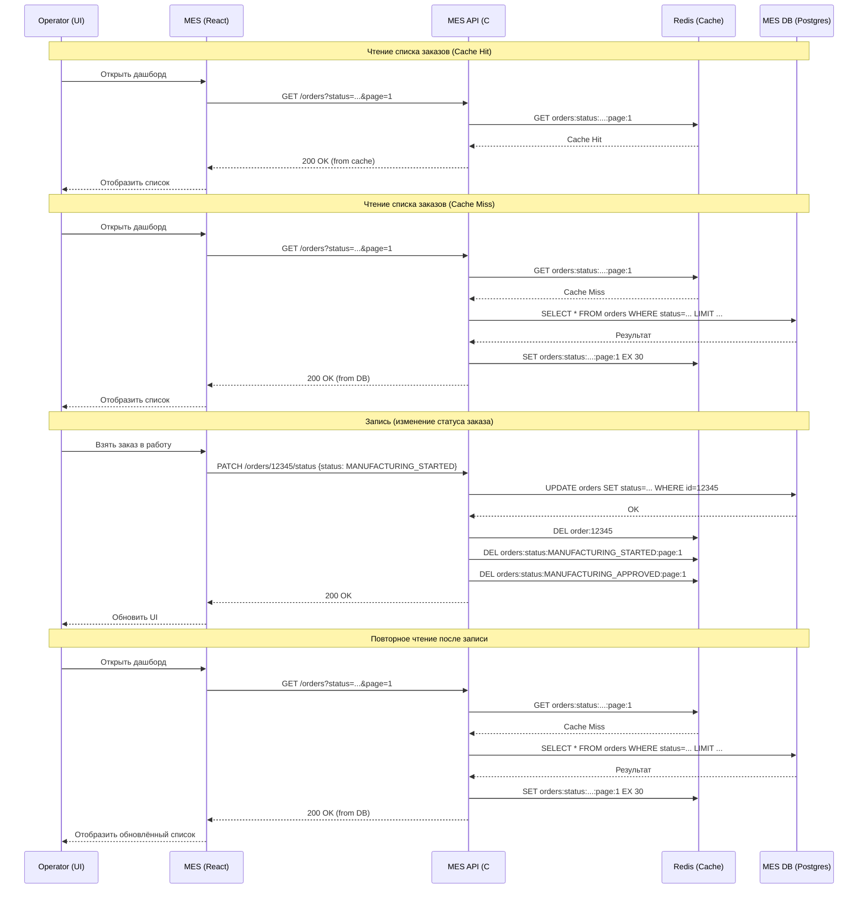

# Архитектурное решение по кешированию

## 1. Мотивация

### 1.1. Проблема

MES — ключевой компонент производственного процесса компании. Операторы работают с ним ежедневно: берут заказы в работу, меняют статусы, упаковывают, отправляют. От скорости работы MES напрямую зависит:

- **Скорость выполнения заказов** — новые клиенты недовольны, что заказ идёт дольше обещанных 3 недель.
- **Вознаграждение операторов** — они видят новые заказы на дашборде и берут их в работу.
- **Пропускная способность производства** — производственные мощности позволяют двукратный рост, но MES тормозит.

**Что уже известно:**
- Первая страница MES (дашборд со списком заказов по статусам) долго прогружается.
- Фильтр по статусам и пагинация не помогли.
- Операторам важно видеть самые новые заказы.
- БД MES — единственный инстанс (PostgreSQL), работает на запись и чтение.
- Каждое приложение (включая MES API) — единственный инстанс EC2.

### 1.2. Что мы планируем кешировать

Проанализировав диаграмму и описание системы, имеет смысл кешировать следующие элементы:

| Элемент | Почему кешируем | Где кешируем |
|---|---|---|
| **Список заказов на дашборде операторов** (с фильтром по статусу и пагинацией) | Самая частая операция чтения. Каждый оператор открывает дашборд несколько раз в день. Данные меняются не так часто (новые заказы появляются, но не каждую секунду). | Серверный кеш (Redis) + клиентский кеш (браузер) |
| **Детали конкретного заказа** | Оператор открывает заказ, чтобы посмотреть 3D-модель, параметры, историю. Данные редко меняются после взятия в работу. | Серверный кеш (Redis) + клиентский кеш |
| **Список активных операторов** | Отображается на дашборде, меняется редко. | Серверный кеш (Redis) |
| **Справочники и словари** (статусы, типы украшений, категории) | Меняются крайне редко, читаются постоянно. | Серверный кеш (Redis) + клиентский кеш |
| **Результаты расчёта стоимости для типовых моделей** | Расчёт занимает 2–3 минуты, до 30 минут для сложных. Если модель типовая — можно кешировать результат. | Серверный кеш (Redis) |
| **Список заказов для CRM** | Продавцы также часто смотрят список заказов. | Серверный кеш (Redis) |

### 1.3. Что даст кеширование

| Проблема сейчас | Что даст кеширование |
|---|---|
| Дашборд MES грузится долго | Дашборд будет отдаваться из кеша за миллисекунды. |
| Операторы теряют время на ожидание | Операторы быстрее берут заказы, производство ускоряется. |
| Новые клиенты недовольны сроками | Сроки выполнения заказов сократятся. |
| БД MES перегружена | Нагрузка на БД снизится в разы (чтение из кеша вместо БД). |
| Расчёт стоимости занимает 30 минут | Для типовых моделей — мгновенно из кеша. |

---

## 2. Предлагаемое решение

### 2.1. Тип кеширования: клиентское + серверное

Предлагаю **комбинированный подход**: и клиентское, и серверное кеширование. Они решают разные задачи и дополняют друг друга.

#### 2.1.1. Клиентское кеширование (браузер)

**Где:** MES (React), CRM (Vue), Онлайн-магазин (Vue).

**Что кешируем:**
- Справочники и словари (статусы, типы украшений).
- Статические ресурсы (JS, CSS, изображения).
- Результаты запросов, которые не меняются часто (детали заказа, список активных операторов).

**Технологии:**
- HTTP-кеширование (`Cache-Control`, `ETag`, `Last-Modified`).
- Service Worker (для офлайн-режима и кеша API-ответов).
- React Query / Vue Query (для кеша данных на клиенте).
- LocalStorage / IndexedDB (для долгосрочного кеша).

**Почему клиентское кеширование нужно:**
- Снижает количество запросов к серверу.
- Ускоряет работу UI (данные уже на клиенте).
- Работает даже при кратковременных сбоях сети.

**Почему клиентского кеширования недостаточно:**
- Не помогает, если данные часто меняются (список заказов).
- Не снижает нагрузку на БД, если каждый клиент делает запрос.
- Не помогает, если у оператора несколько вкладок или устройств.

#### 2.1.2. Серверное кеширование (Redis)

**Где:** MES API (C#), CRM API (Spring Boot), Shop API (Spring Boot).

**Что кешируем:**
- Список заказов на дашборде (с фильтром по статусу и пагинацией).
- Детали конкретного заказа.
- Список активных операторов.
- Справочники и словари.
- Результаты расчёта стоимости для типовых моделей.
- Список заказов для CRM.

**Технологии:**
- **Redis** — in-memory хранилище, идеально для кеша.
- **StackExchange.Redis** (C#), **Spring Data Redis** (Java).
- **Redis Cluster** — для отказоустойчивости.

**Почему серверное кеширование нужно:**
- Снижает нагрузку на БД MES (единственный инстанс).
- Ускоряет ответы API для всех клиентов.
- Позволяет кешировать результаты тяжёлых вычислений (расчёт стоимости).
- Централизованное управление кешем.

### 2.2. Паттерн кеширования: Cache-Aside

**Cache-Aside** для серверного кеширования.

#### 2.2.1. Как работает Cache-Aside

1. Приложение пытается прочитать данные из кеша.
2. Если данных нет — читает из БД.
3. Записывает данные в кеш.
4. Возвращает данные клиенту.
5. При изменении данных — инвалидирует кеш (удаляет или обновляет).

#### 2.2.2. Почему Cache-Aside, а не Write-Through или Refresh-Ahead

| Критерий | Cache-Aside | Write-Through | Refresh-Ahead |
|---|---|---|---|
| **Сложность** | Низкая | Средняя | Высокая |
| **Нагрузка на БД при записи** | Низкая (пишем только в БД) | Высокая (пишем и в БД, и в кеш) | Средняя |
| **Актуальность данных** | Высокая (инвалидация при записи) | Высокая | Средняя (может быть устаревшим) |
| **Нагрузка на кеш** | Низкая (кеш только для чтения) | Высокая | Высокая |
| **Подходит для нашего случая** | Да | Частично | Нет |

**Почему Cache-Aside:**
- Наши данные **чаще читаются, чем пишутся**. Список заказов читается постоянно, а меняется не так часто.
- Мы **не хотим писать в кеш при каждой записи** — это увеличит нагрузку и сложность.
- Мы **хотим контролировать инвалидацию** — при смене статуса заказа мы точно знаем, какой ключ удалить.
- Простота реализации и отладки.

**Почему не Write-Through:**
- Write-Through пишет в кеш и БД одновременно. Это увеличивает нагрузку на кеш и БД.
- Для нашего случая это избыточно: мы не так часто пишем, чтобы это было критично.
- Write-Through хорош, когда данные часто обновляются и должны быть всегда актуальны в кеше. У нас не тот случай.

**Почему не Refresh-Ahead:**
- Refresh-Ahead обновляет кеш заранее, до истечения TTL. Это сложно настроить и легко ошибиться.
- Он хорош для данных, которые часто читаются и редко меняются. У нас список заказов меняется часто.
- Refresh-Ahead может обновлять данные, которые уже не нужны, — это лишняя нагрузка.
- Для нашего случая это overkill.

### 2.3. Стратегия инвалидации кеша

Предлагаю **комбинированную стратегию**:

1. **Инвалидация по ключу (Key-based Invalidation)** — основная стратегия.
2. **Временная инвалидация (TTL)** — как fallback.

#### 2.3.1. Инвалидация по ключу

**Как работает:**
- При изменении данных (смена статуса заказа, создание нового заказа) приложение **явно удаляет** соответствующие ключи из кеша.
- Например, при смене статуса заказа #12345:
  - Удаляем `order:12345`.
  - Удаляем `orders:status:MANUFACTURING_STARTED:page:1`.
  - Удаляем `orders:status:MANUFACTURING_COMPLETED:page:1`.
  - И так далее для всех затронутых статусов.

**Почему это подходит:**
- Мы точно знаем, какие данные изменились.
- Мы можем точечно инвалидировать только нужные ключи.
- Данные всегда актуальны после инвалидации.

**Сложности:**
- Нужно аккуратно проектировать ключи, чтобы понимать, какие из них инвалидировать.
- При сложных запросах (фильтры, пагинация) может быть много ключей.

#### 2.3.2. Временная инвалидация (TTL)

**Как работает:**
- Каждый ключ в кеше имеет TTL (Time To Live).
- По истечении TTL ключ автоматически удаляется.
- При следующем запросе данные загружаются из БД и снова кешируются.

**Почему это нужно:**
- Как fallback: если инвалидация по ключу не сработала (баг, сбой), TTL всё равно удалит устаревшие данные.
- Для данных, которые не критично иметь всегда актуальными (справочники, список операторов).

**TTL для разных данных:**

| Данные | TTL | Почему |
|---|---|---|
| Список заказов на дашборде | 30 секунд | Данные должны быть актуальными, но не критично до секунды. |
| Детали заказа | 5 минут | Заказ меняется редко после взятия в работу. |
| Список активных операторов | 1 минута | Меняется редко. |
| Справочники и словари | 1 час | Меняются крайне редко. |
| Результаты расчёта стоимости | 24 часа | Типовые модели не меняются. |
| Список заказов для CRM | 1 минута | Продавцы должны видеть актуальные данные. |

#### 2.3.3. Сравнительный анализ стратегий инвалидации

| Критерий | Инвалидация по ключу | Временная (TTL) | Программная (по событию) |
|---|---|---|---|
| **Актуальность** | Высокая | Средняя (зависит от TTL) | Высокая |
| **Сложность** | Средняя | Низкая | Высокая |
| **Нагрузка на БД** | Низкая | Средняя (при истечении TTL) | Низкая |
| **Риск устаревших данных** | Низкий | Средний | Низкий |
| **Подходит для нашего случая** | Да | Да (как fallback) | Частично |

**Почему не только временная:**
- TTL не гарантирует актуальность: между изменением данных и истечением TTL данные в кеше устаревшие.
- Для списка заказов это критично: оператор может не увидеть новый заказ.

**Почему не только программная:**
- Программная инвалидация (по событию) требует сложной инфраструктуры (event bus, подписчики).
- У нас уже есть RabbitMQ, но добавлять ещё один слой сложности не хочется.
- Инвалидация по ключу проще и надёжнее.

**Почему комбинированная (ключ + TTL):**
- Инвалидация по ключу обеспечивает актуальность.
- TTL — страховка на случай сбоев.
- Простота реализации.

### 2.4. Диаграмма последовательности

**Участники кеширования:**
- **Operator** — пользователь MES.
- **MES (React)** — фронтенд, может использовать React Query для клиентского кеша.
- **MES API (C#)** — бэкенд, управляет серверным кешем.
- **Redis** — серверный кеш.
- **MES DB (PostgreSQL)** — источник истины.

**Ключи кеша:**
- `order:{order_id}` — детали заказа.
- `orders:status:{status}:page:{page}` — список заказов по статусу и странице.
- `orders:operator:{operator_id}:page:{page}` — список заказов оператора.
- `operators:active` — список активных операторов.
- `dictionaries:{type}` — справочники.
- `price:model:{model_hash}` — результат расчёта стоимости.

### 2.5. Компоненты, которые нужно внедрить или доработать

#### Новые компоненты

1. **Redis** — развернуть в Yandex Cloud (Managed Redis или self-hosted).
   - Режим: Cluster с репликацией.
   - Память: 4–8 GB (достаточно для кеша).
   - Персистентность: RDB + AOF (на случай перезапуска).

2. **Redis Client** — библиотека для подключения к Redis.
   - MES API (C#): `StackExchange.Redis`.
   - CRM API (Spring Boot): `Spring Data Redis` (Lettuce).
   - Shop API (Spring Boot): `Spring Data Redis` (Lettuce).

#### Доработки существующих компонентов

1. **MES API (C#):**
   - Подключить `StackExchange.Redis`.
   - Реализовать Cache-Aside для списка заказов, деталей заказа, справочников.
   - Реализовать инвалидацию по ключу при смене статуса.
   - Настроить TTL для каждого типа данных.

2. **CRM API (Spring Boot):**
   - Подключить `Spring Data Redis`.
   - Реализовать Cache-Aside для списка заказов.
   - Реализовать инвалидацию по ключу.

3. **Shop API (Spring Boot):**
   - Подключить `Spring Data Redis`.
   - Реализовать Cache-Aside для справочников и каталога.
   - Реализовать инвалидацию по ключу.

4. **MES (React):**
   - Подключить React Query для клиентского кеша.
   - Настроить `staleTime` и `cacheTime` для разных запросов.

5. **CRM (Vue):**
   - Подключить Vue Query для клиентского кеша.

6. **Онлайн-магазин (Vue):**
   - Подключить Vue Query для клиентского кеша.
   - Настроить HTTP-кеширование для статики.

### 2.6. Схема с новыми компонентами

**Ссылка на диаграмму:** [C4-container with cache](https://github.com/sproggi/architecture-alexandrite/blob/developer/Task5/с4_container_with_cache.drawio)

**Новые зелёные компоненты:**
- **Redis** — серверный кеш.

**Новые зелёные связи:**
- MES API → Redis.
- CRM API → Redis.
- Shop API → Redis.

### 2.7. Стратегия инвалидации кеша: сравнительный анализ

| Критерий | Инвалидация по ключу | Временная (TTL) | Программная (по событию) |
|---|---|---|---|
| **Как работает** | При изменении данных приложение удаляет конкретные ключи из кеша. | Каждый ключ имеет TTL, по истечении которого удаляется. | При изменении данных публикуется событие, подписчики инвалидируют кеш. |
| **Актуальность** | Высокая — данные актуальны сразу после инвалидации. | Средняя — данные устаревшие до истечения TTL. | Высокая — данные актуальны после обработки события. |
| **Сложность реализации** | Средняя — нужно знать, какие ключи инвалидировать. | Низкая — просто устанавливаем TTL. | Высокая — нужна инфраструктура событий (event bus, подписчики). |
| **Нагрузка на БД** | Низкая — читаем из БД только при cache miss. | Средняя — при истечении TTL идёт запрос в БД. | Низкая — читаем из БД только при cache miss. |
| **Нагрузка на кеш** | Низкая — удаляем только нужные ключи. | Низкая — TTL обрабатывается автоматически. | Средняя — нужно обрабатывать события. |
| **Риск устаревших данных** | Низкий — если правильно спроектированы ключи. | Средний — данные устаревшие до истечения TTL. | Низкий — если события обрабатываются надёжно. |
| **Подходит для нашего случая** | Да — основная стратегия. | Да — как fallback. | Частично — избыточно. |

**Вывод:** используем **комбинированную стратегию**:
- **Инвалидация по ключу** — основная. При смене статуса заказа удаляем `order:{id}` и все `orders:status:{status}:page:{page}`, которые могли измениться.
- **Временная (TTL)** — fallback. Устанавливаем TTL для всех ключей, чтобы гарантированно избавляться от устаревших данных, даже если инвалидация по ключу не сработала.

**Почему не только TTL:**
- Для списка заказов TTL 30 секунд означает, что оператор может не видеть новый заказ до 30 секунд. Это критично для их вознаграждения.
- Для деталей заказа TTL 5 минут означает, что изменения могут быть не видны до 5 минут.

**Почему не только программная:**
- У нас уже есть RabbitMQ, но добавлять ещё один слой событий для инвалидации кеша — избыточно.
- Инвалидация по ключу проще и надёжнее.
- Программная инвалидация хороша, когда много сервисов и сложные зависимости. У нас не тот случай.

**Почему не Write-Through и Refresh-Ahead:**
- Write-Through увеличивает нагрузку на кеш и БД при записи.
- Refresh-Ahead сложен в настройке и может обновлять ненужные данные.
- Cache-Aside с инвалидацией по ключу — оптимальный баланс простоты и актуальности.

---

## 3. Выводы

1. **Кеширование необходимо** для решения проблем MES: долгая загрузка дашборда, медленная работа операторов, долгие сроки выполнения заказов.

2. **Комбинированный подход:** клиентское кеширование (React Query, HTTP-кеш) + серверное кеширование (Redis).

3. **Паттерн Cache-Aside** — оптимальный выбор: простой, эффективный, не увеличивает нагрузку на запись.

4. **Стратегия инвалидации:** инвалидация по ключу (основная) + TTL (fallback). Это обеспечивает актуальность данных и защиту от сбоев.

5. **Что кешируем:** список заказов на дашборде, детали заказа, список операторов, справочники, результаты расчёта стоимости.

6. **Ожидаемый эффект:** дашборд грузится за миллисекунды, операторы быстрее берут заказы, сроки выполнения сокращаются, нагрузка на БД MES снижается.